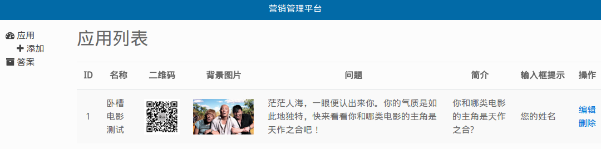

# wcmovie_test
「卧槽电影」公众号营销用 Web 游戏。

### run steps
- add config.py
```
DOMAIN = ''
DB_HOST = ''
DB_NAME = ''
DB_USER = ''
DB_PWD = ''

QINIU_AK = ''
QINIU_SK = ''
QINIU_BUCKET_NAME = ''
```
- you can read `optsql/db.py` for checking what sql tables need to create
- run `server.py`

### note
if you need a admin, please switch to the **[added_admin](https://github.com/nekocode/wcmovie_test/tree/added_admin)** branch.

### screenshots


